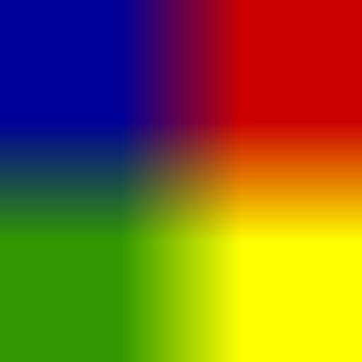
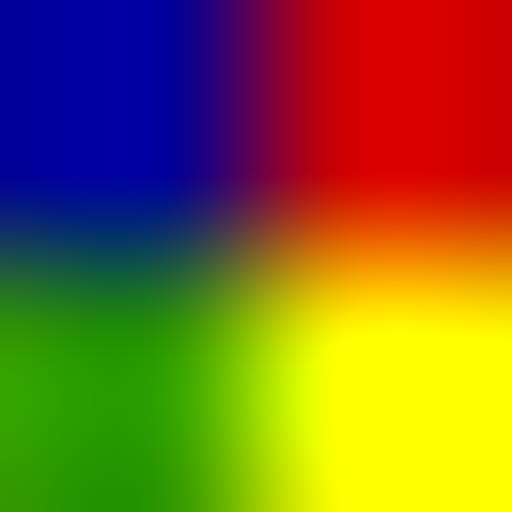

# Лабораторная работа по теме «Изменение размеров изображения с применением алгоритмов улучшения качества» по дисциплине «Компьютерная графика»

## Задание

Для произвольного изображения выполнить масштабирование с произвольным коэффициентом. В качестве тестовых изображении взять:
- Изображение с фотокачеством
- Произвольные геометрические фигуры (кольца, круги, линии).
 
Выполнить сглаживание и провести сравнительный анализ следующих методов:
- Билинейное сглаживание
- Бикубическое сглаживание

## Выполнение работы

Пример для изображения 4х4 пикселей, которое увеличили в 128 раз.

| Билинейный        | Бикубический      |
| ----------------- | ----------------- |
|  |  |

Видно, что бикубический метод лучше сгладил изображение.